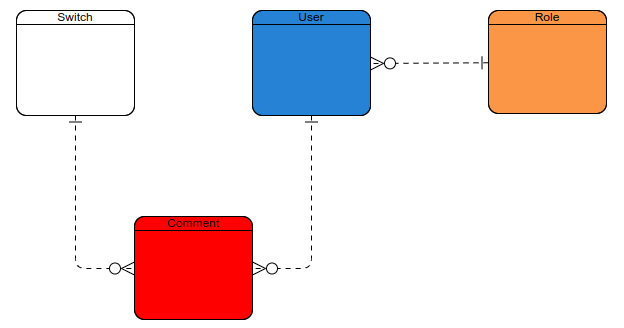

# Образец Zabbix-приложения

*API backend приложение, реализующее простую систему мониторинга статусов разнообразного сетевого оборудования*.

### Общая идея задачи:

У приложения имеются Пользователи и Коммутаторы. 
У пользователя есть три Роли: Персонал, Модератор и Администратор. 
У коммутатора есть Комментарии, которые может оставлять 
пользователь в роли модератора или администратора. Коммутатор 
автоматически меняет свое состояние работоспособности через 
определенные промежутки времени, устанавливаемые админом. 
Администратор может добавлять и удалять коммутаторы, модератор может 
редактировать их содержимое, а персонал может просматривать их. 

### Функционал

1. Первый администратор создается автоматически программой.
2. Я как администратор могу создать учетную запись пользователя. 
3. Я как пользователь могу авторизироваться в приложении.
4. Я как администратор могу обновить учетную запись пользователя.
5. Я как администратор могу удалить учетную запись пользователя.
6. Я как модератор могу создать коммутатор.
7. Я как администратор могу выбирать временой промежуток для регулярного пингования по айпи-адресам коммутатора.
8. Я как модератор удалить коммутатор.
9. Я как модератор могу обновить коммутатор.
10. Я как модератор могу оставить комментарий к коммутатору.
11. Я как модератор могу удалить комментарий к коммутатору.
12. Я как пользователь могу получить список всех коммутаторов.
13. Я как пользователь могу получить список всех неработающих коммутаторов.
14. Я как пользователь могу посмотреть подробную информацию по коммутатору.
15. Я как пользователь могу узнать географическое положение всех коммутаторов, сгруппированных по их активности.
16. Я как пользователь могу посмотреть все комментарии у коммутатора.

### АРХИТЕКТУРА ПРИЛОЖЕНИЯ

#### ПОЛЬЗОВАТЕЛЬ

    id - порядковый номер пользователя.
    login - уникальное наименование учетной записи.
    Password - ключ безопасности учетной записи.
    role_id - ссылка на роль.
    created_at - дата и время регистрации учетной записи.
    updated_at - дата и время обновления учетной записи.
    deleted - показатель видимости учетной записи в реестре: активна/в архиве;
    deletedAt - дата и время помещения учетной записи в архив для удаления;

#### РОЛЬ

    id - порядковый номер роли. 
    name - уникальное название роли. 
    created_at - дата и время учреждения роли.

#### КОММУТАТОР

    id - порядковый номер коммутатора.
    name - уникальное наименование оборудования, соответствующее названию улицы и номеру дома, на котором оно установлено. 
    model - название модели оборудования и количество установленных портов. 
    ip_adress - уникальный АйПи адресс, установленный при добавлении коммутатора. 
    coordinates - географические метки расположения коммутатора.
    state - состояние работоспособности коммутатора: активен/неактивен.
    deleted - показатель видимости коммутатора в реестре: активен/в архиве;
    deletedAt - дата и время помещения коммутатора в архив для удаления;

#### КОММЕНТАРИЙ 

    id - порядковый номер комментария.
    message - текстовое сообщение.
    сreated_at - дата и время написания комментария.
    user_id - ссылка на пользователя, добавившего комментарий.
    switch_id - ccылка на коммутатор, к которому оставили комментарий. 

### Связи между сущностями

У Пользователя может быть одна Роль, у одной Роли может быть много Пользователей. 
У Комментария с Пользователями и Коммутаторами связь один ко многим (у Комментария может быть один Пользователь и Коммутатор, 
тогда как у Коммутатора и Пользователя может быть много Комментариев).

 Рисунок со связями сущностей приведен ниже: 

    

  Рисунок 1 - связи сущностей для проекта  

### ТЕХНИЧЕСКИЕ ДЕТАЛИ ФУНКЦИОНАЛА

*Примечания к пунктам функционала*

1. Учетная запись первого пользователя с ролью Администратор создается или в СУБД PostgreSQL, или SQL-скриптом в SpringBoot.
2. Администратор назначает роли: персонал (**staff**), модератор (**moder**), администратор (**admin**). Модератор наследует все полномочия персонала, 
а администратор наследует все полномочия модератора. При создании администратором учетной записи, если роль не заполнена, то **по умолчанию** присваивается 
значение персонал (**staff**). 
3. Регистрация  и авторизацию будет реализовываться с помощью спользования  токенов JWT, без технологии Spring Security OAuth 2.
4. Только администратор может изменить роль пользователя и его пароль.
5. Администратор может удалить пользователя только по его **логину**. Так же, если в системе остался последний администратор, нельзя удалять его учетную запись. Операции delete должны из себя представлять мягкое удаление (soft delete) с архивированием и последующим автоматическим удалением через заданное время.
6. Значение параметра state у сущности Коммутатор модератор или администратор не может указать или изменить: этот параметр добавляется и изменяется 
автоматически программой, ***(см. пункт 7)***.
7. В приложении есть несколько экземпляров класса SwitchEntity. У класса есть поле **IPAdress**, в котором хранится ip адресс оборудования, и поле **Status** - 
булевое значение, указывающее на доступность сетевого соединения с оборудованием. Скрипт в приложении SpringBoot автоматически и регулярно раз в **N**-минут
(где N - время, которое задает пользователь с ролью администратор) посылает пинг запрос по ip адрессу каждого экземпляра SwitchEntity. 
И если ответ от пинга был успешен, то в поле Status принимает значение True, а если нет - False.   
8. Администратор или модератор может удалить коммутатор только по его **айпи-адрессу**.
9. Пользователь может найти коммутатор только по его **IP-адресу** или **названию**.

По ходу выполнения проекта, техническое задание может изменяться. Cправочная информация бралась с сайтов stackoverflow.com, baeldung.com, mistral.ai

